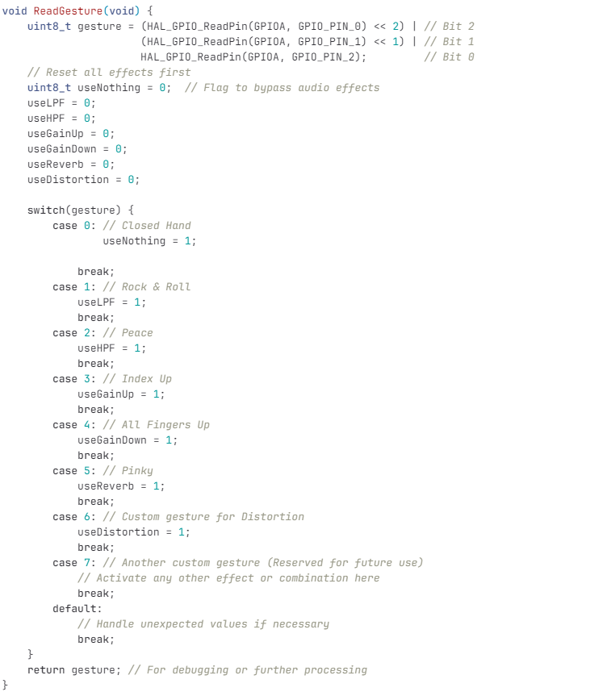
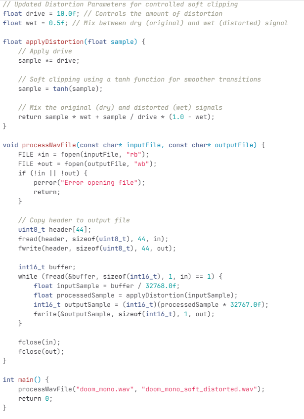
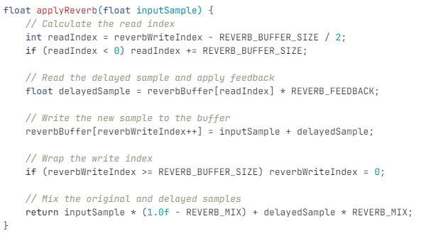

# Zachary Baum
2/14/2024: Had meeting with TA about the project proposal and what we neededd to add and get rid of. The main things were to trim down the high level objectives, be more clear in the block diagram, and better structure the subsystem descriptions. We also asked about power going into the raspberry pi and if it would be consideredd an external module

2/20/2024: Couldnt attend meetings due to sickness but worked on the design document specfically the audio subsystem for the requirements and veruification portion. I also researched what ampiflier and speaker we should use as well as discussed DSP functionality of the project with partners.

2/27/2024: Gave our design presentation and got feedback on it. main thing for me was that I need to make sure I know what libraries I will be using for an FFT aspects for the stm32 code. Overall the presentation went well and I will start working on the code for the audio effects. 

3/5/2024: Looked more into what audio effects we should use and decided on scrapping the delay effect for now since it would be more difficult to implement and I instead will be replacing it with distortion since I have seen a lot of different ways people have implemented it. Also got all the software I need to start coding

3/12/2024: Created the STM32 project and took some time learning the STM32cube IDE and what aspects I will need to focus on for this project. Main things I learned was what pins I will need to configure for the project and what frequency we should be using

3/19/2024: Successfully coded 3 out of the 5 effects with those being distortion, High pass and low pass filtering. All thats left is gain adustment which should be easy and then reverb which will be more challenging. In terms of syntax the code is fine and logically it makes sense but I still need to test the code on a physical board

3/25/2024: Discussed with partners on where each of us are at right now, we all seem on a good track with some minor setbacks and we decided to start doing physical testing and getting everything to work together starting next week. This will probably be the most challenging part of the project and will take some time.

4/1/2024: I made the code that should be able to take the binary input from the gestures control and apply the affect but I had a lot of trouble trying to get the audio to work with the dev board since I didnt have an sd card and I tried to store the audio onto the STM32 however it was too large and the program would not compile because of it

4/8/2024: I made the code that will communicate with the gesture control system by taking in 3 gpios and based off that 3 bit value will determine which effect will be applied. Cannot test the code until the PCB is working and we have the right components

4/15/2024: Tested C code of audio effects on a c complier to see if the actual effects on the stm32 code would work. Luckily I was able to get Reverb and Distortion applied to a wav file. I was not able to get low pass to work due to libraries not importing to the compiler.

4/22/2024: Helped team debug issues with PCB not compiling the stm32 code onto the chip. The problem was that the run configuration for the stm32cube project required a different external loader. Now we got the LCD to work and the board is able to be programmed. However due to time we will not be able to debug the code for the audio effects subsystem